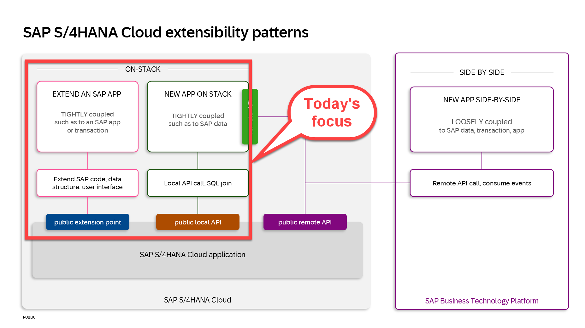

# DT280 - Cloud ERP Extensibility

## Description

This repository contains the material for the RAP hands-on workshop called _Cloud ERP Extensibility_ where _on-stack Developer Extensibility_ is used.  

Developer extensibility as defined by SAP basically encompasses two activities 

1. Develop custom code to implement your own business logic.   

   Here you can make use of existing API's from SAP that have been released for that purpose.
   
3. Extend an existing RAP Business Object so that additional business functionality is added.

   Such an extensible RAP business object will usually reside in another software components or it is an existing extensible RAP BO that has been delivered by SAP or a SAP partner.  
   By extending the funcitionality of an existing RAP Business object its functionality can be adapted to your specific business requirements.

   

## Overview

This session introduces attendees to the ABAP Cloud programming model and how this can be leveraged how
- to build extensions (own code) in _SAP S/4HANA ABAP Environment_ _SAP BTP ABAP Environment_ or and  
- to extend an existing RAP Business Object using the ABAP Cloud programming model.   

## 📋Requirements for attending this workshop 
[^Top of page](#)

The requirements to follow the exercises in this repository are:  

1. [Install the latest Eclipse platform and the latest ABAP Development Tools (ADT) plugin](https://developers.sap.com/tutorials/abap-install-adt.html)  
2. [Create an user on the SAP BTP, ABAP environment Trial](https://developers.sap.com/tutorials/abap-environment-trial-onboarding.html)   
3. [Create an ABAP Cloud Project](https://developers.sap.com/tutorials/abap-environment-create-abap-cloud-project.html)  

## Slides
[Presentation](https://github.com/SAP-samples/abap-platform-rap630/blob/main/slides/RAP630_RAP_Extensibility_2405.pdf) 

## 🛠 Exercises
[^Top of page](#)

## Exercises

In the _Getting Started_ section you will generate 
- two exercise packages and
- an extensible managed Business Object (BO) with one entity _Shop_ with generic transactional behavior - i.e. CRUD: Create, Read, Update, and Delete. 

The first aspect of developer extensibility is how to use RAP business objects that have been C1-released by SAP or SAP partners for the use in ABAP Cloud development.   

In _Exercise 1_ you will learn how you can leverage the released RAP business object `I_BankTP`. You will learn how you can use a new wizard in ADT that lets you generate a custom UI on top of a released RAP business object without having to write a single line of code. An additional (optional) task is to call the same released RAP business object from within a class which shows how released RAP business objects can also be used in application jobs.

The second aspect of developer extensibility is the option to extend an extensible RAP business object that has been delivered by SAP or a SAP partner.  

In _Exercise 2_ you will _extend the behavior_ of the base RAP business object that has been generated in the _Getting Started_ section. You will learn how extend the behavior of the base RAP BEO by validations, determinations and side effects. 

In _Exercise 3_ you will then continue to _extend the data model_ with additional fields. Here you will use the new **_Extension Field Wizard_** which has recently been delivered for the ABAP Environement systems.  

In _Exercise 4_ you will continue to _extend the behavior_ of the base RAP business object by adding an action. Since actions can only added via an extension to fields that have been added itself via an extension, adding an action via an extension must be performed after Exercise 3.   

So let us start and have a look at the _Getting Started_ section.

   - [Getting Started - Generate starter package](exercises/ex0/)   

You can the continue and build custom code that leverages released API's

   -  [Exercise 1 - New App on stack (Developer Extensibility)](exercises/ex1/)   

Finally you will learn how to extend a RAP Business object   

   - [Exercise 2, 3 and 4 - Extend a RAP business object (behavior and data model)](exercises/ex2/README_235.md)   

## Online Help

https://help.sap.com/docs/abap-cloud/abap-rap/develop-rap-extensions
https://help.sap.com/docs/SAP_S4HANA_CLOUD/6aa39f1ac05441e5a23f484f31e477e7/1b345c53060846b091f55ea901e21ae7.html

## Download and Installation

You have to install the latest version of ADT as described in section **Requirements for attending this workshop**.  

## Known Issues

No known issues.  

## How to obtain support

[Create an issue](https://github.com/SAP-samples/teched2024-DT280/issues) in this repository if you find a bug or have questions about the content.
 
For additional support, [ask a question in SAP Community](https://answers.sap.com/questions/ask.html).

## Contributing
If you wish to contribute code, offer fixes or improvements, please send a pull request. Due to legal reasons, contributors will be asked to accept a DCO when they create the first pull request to this project. This happens in an automated fashion during the submission process. SAP uses [the standard DCO text of the Linux Foundation](https://developercertificate.org/).

## Code of Conduct
Please read the [SAP Open Source Code of Conduct](https://github.com/SAP-samples/.github/blob/main/CODE_OF_CONDUCT.md).

## License
Copyright (c) 2023 SAP SE or an SAP affiliate company. All rights reserved. This project is licensed under the Apache Software License, version 2.0 except as noted otherwise in the [LICENSE](LICENSE) file.
